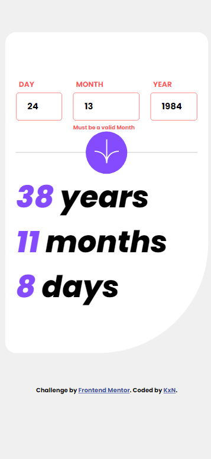

# Frontend Mentor - Age calculator app solution

This is a solution to the [Age calculator app challenge on Frontend Mentor](https://www.frontendmentor.io/challenges/age-calculator-app-dF9DFFpj-Q). Frontend Mentor challenges help you improve your coding skills by building realistic projects. 

## Table of contents

- [Overview](#overview)
  - [The challenge](#the-challenge)
  - [Screenshot](#screenshot)
  - [Links](#links)
- [My process](#my-process)
  - [Built with](#built-with)
  - [What I learned](#what-i-learned)
- [Author](#author)

## Overview
  This is an Age Calculator challenge by frontend mentors

### The challenge

Users should be able to:

- View an age in years, months, and days after submitting a valid date through the form
- Receive validation errors if:
  - Any field is empty when the form is submitted
  - The day number is not between 1-31
  - The month number is not between 1-12
  - The year is in the future
  - The date is invalid e.g. 31/04/1991 (there are 30 days in April)
- View the optimal layout for the interface depending on their device's screen size
- See hover and focus states for all interactive elements on the page

### Screenshot

### Links

- Solution URL: [Github Repo](https://github.com/kxn69/age-calculator)
- Live Site URL: [Live site](https://kxn69.github.io/age-calculator/)

## My process

I started with building the UI and made sure it was fully responsive, then I worked on the script to make the app functional

### Built with

- Semantic HTML5 markup
- CSS custom properties
- Flexbox
- CSS Grid
- [Font](https://fonts.google.com/specimen/Poppins/) - For font styles

**Note: These are just examples. Delete this note and replace the list above with your own choices**

### What I learned

While building this app, I learned more on dates and its use cases.

## Author

- Frontend Mentor - [@kxn69](https://www.frontendmentor.io/profile/kxn69)
- Twitter - [@ayokxnmi](https://www.twitter.com/ayokxnmi)
